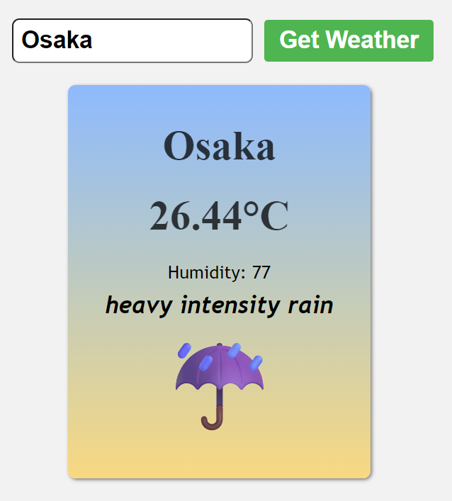

# Weather App

A simple yet functional Weather App that fetches real-time weather data based on the city input by the user. The purpose of this project was to deepen my understanding of APIs, asynchronous JavaScript, and DOM manipulation by building a practical, interactive tool.

## Why I Built The Weather App project

I wanted to strengthen my knowledge of:
- Fetching and handling data from external APIs.
- Asynchronous operations using `async/await`.
- Dynamically updating the DOM.
- Error handling in real-world web applications.

By building a weather application, I was able to work with external data in a meaningful way and improve my JavaScript skills.


## Weather App Features

- Real-time weather data using OpenWeatherMap API.
- Dynamic UI updates based on user input.
- Displays temperature, humidity, weather description, and an emoji representing the weather condition.
- Error handling for invalid input or failed API requests.


## Weather App Code Overview

### `index.js`

```javascript
const weatherFrom = document.querySelector('.weatherForm');
const cityInput = document.querySelector('.cityInput');
const card = document.querySelector('.card');
const apiKey = "YOUR_API_KEY"; // Replace with your actual key

weatherFrom.addEventListener('submit', async event => {

    event.preventDefault();
    const city = cityInput.value;

    if(city){
        try{
            const weatherData = await getWeatherData(city);
            displayWeatherInfo(weatherData);
        }
        catch(error){
            console.error(error)
            displayError(error)
        }
    }
    else{
        displayError("Please Enter A City")
    }
})

async function getWeatherData(city) {

    const apiUrl = `https://api.openweathermap.org/data/2.5/weather?q=${city}&appid=${apiKey}`;

    const response = await fetch(apiUrl);

    if(!response.ok){
        throw new Error("Could not fetch weather data");
    }
    return await response.json()

}

function displayWeatherInfo(data){
    console.log(data)
    const {name: city, 
           main: {temp, humidity}, 
           weather: [{description, id}]} = data;

    card.textContent = "";
    card.style.display = "flex";

    const cityDisplay = document.createElement("h1");
    const tempDisplay = document.createElement("p");
    const humidityDisplay = document.createElement("p");
    const descDisplay = document.createElement("p");
    const weatherEmoji = document.createElement("p");

    cityDisplay.textContent = city;
    tempDisplay.textContent = `${(temp - 275).toFixed(2)}°C`;
    humidityDisplay.textContent = `Humidity: ${humidity}`;
    descDisplay.textContent = description;
    weatherEmoji.textContent = getWeatherEmoji(id);

    cityDisplay.classList.add("cityDisplay")
    tempDisplay.classList.add("tempDisplay");
    tempDisplay.classList.add("humidityDisplay");
    descDisplay.classList.add("descDisplay");
    weatherEmoji.classList.add("weatherEmoji");

    card.appendChild(cityDisplay);
    card.appendChild(tempDisplay);
    card.appendChild(humidityDisplay);
    card.appendChild(descDisplay);
    card.appendChild(weatherEmoji);
}

function getWeatherEmoji(weatherId){

    switch(true){
        case (weatherId >= 200 && weatherId < 300):
            return "⛈️";
        case (weatherId >= 300 && weatherId < 400):
            return "☔";
        case (weatherId >= 500 && weatherId < 600):
            return "☔";
        case (weatherId >= 600 && weatherId < 700):
            return "❄️";
        case (weatherId >= 700 && weatherId < 800):
            return "🌁";
        case (weatherId === 800):
            return "☀️";
        case (weatherId >= 801 && weatherId < 810):
            return "☁️";
        default:
            return "❓";

    }
}

function displayError(message){

    const errorDisplay = document.createElement("p");
    errorDisplay.textContent = message;
    errorDisplay.classList.add("errorDisplay");

    card.textContent = "";
    card.style.display = "flex";
    card.appendChild(errorDisplay);
}
```

## What I Learnt

This project helped reinforce several JavaScript concepts:
- **Fetch API:** I learnt how to use the *fetch()* method to make HTTP requests and handle responses using *.json()*.
- **Async/Await:** Using *async/await* made asynchronous code more readable and easier to manage, especially when handling network requests.
- **API Integration:** I gained experience using a public API (OpenWeatherMap), handling API keys, constructing URLs, and parsing JSON responses.
- **DOM Manipulation:** Dynamically creating and updating elements helped me better understand the DOM and event-driven programming.
- **Error Handling:** I implemented error handling to manage failed requests and invalid user input, making the app more user-friendly and robust.

## How to Run It
1. Clone the repo:
- [git clone here](https://github.com/LinusBwana/weather-app.git)
- cd weather-app
2. Replace `"YOUR_API_KEY"` with your actual API key from [OpenWeatherMap](https://openweathermap.org/).
3. Open *index.html* in your browser.

## Weather App Screenshot
I searched Osaka, Japan and it worked as shown below

